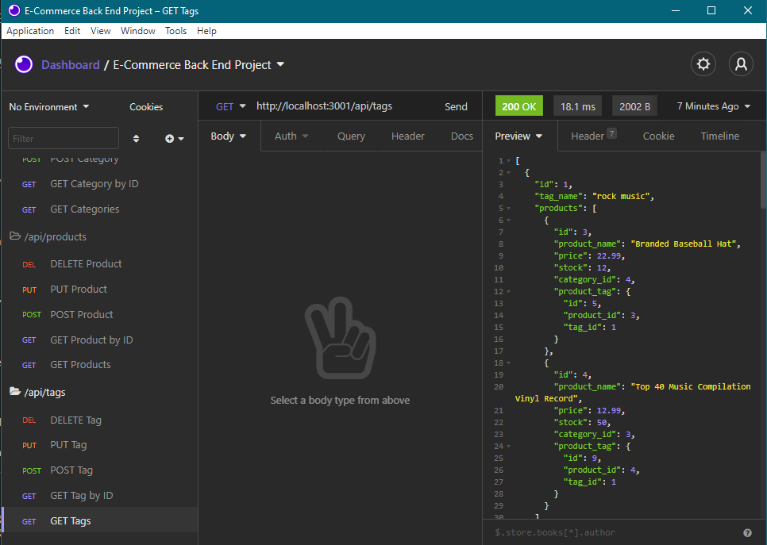

# E-CommerceBackEnd

## Table of Contents

1. [Description](#Description)
2. [Criteria](#Criteria)
3. [Installation](#Installation)
4. [Usage](#Usage)
5. [Contributing](#Contributing)
6. [Issues](#Issues)
7. [License](#License)
8. [Questions](#Questions)

## Description

We were tasked with developing the back-end portion of a database application. We were given starter code to work from. This code does not have a front-end built, so it requires Insomnia or some other program like it in order to be viewed.

This particular application works with a database based around products, including a products table, categories table, and tags table. There is also a Product Tags table that is used for linking Products to Tags.

One thing I ran into was that in the example exercise I was working from, they used "as" for the relationship on the many-to-many models. The problem was that when I ran it with JOIN's in MySql, it created both a "product_id" and "tag_id" and also a "productId" and "tagId." I found that removing the "as" and replacing it with a "foreignKey" fixed the issue.

Unable to be deployed.

[Link to video demonstration](https://drive.google.com/file/d/12RlYak7ZYNKp90iUNzag9xb3Ef0F9aN4/view)

Example picture:

## Criteria

GIVEN a functional Express.js API

WHEN I add my database name, MySQL username, and MySQL password to an environment variable file

THEN I am able to connect to a database using Sequelize

    * Enabled using dotenv and providing an EXAMPLE .env file for users.

WHEN I enter schema and seed commands

THEN a development database is created and is seeded with test data

    * This was provided for us.

WHEN I enter the command to invoke the application

THEN my server is started and the Sequelize models are synced to the MySQL database

    * This was provided for us.

WHEN I open API GET routes in Insomnia Core for categories, products, or tags

THEN the data for each of these routes is displayed in a formatted JSON

    * Created GET routes for the models Category, Product, and Tag

    * Within the GET route, it fetches the model data from the database

    * An include is used to get info from all tables, as needed

WHEN I test API POST, PUT, and DELETE routes in Insomnia Core

THEN I am able to successfully create, update, and delete data in my database

    * Created routes for each Model for each type of fetch

    * Also added ON DELETE SET NULL for deleting Categories.

## Installation

Files must be downloaded from Github. Then, run npm install to get the necessary node modules. Edit or duplicate the .env.EXAMPLE file to be just a .env file and fill in your MySql username and password. Open the schema.sql in MySql and run the file. Back in the code application, run node seeds to fill information into the database. Last, run npm start.

## Usage

This is an application in which the user can view and edit data in a database with information about employees, job roles, and departments.

## Contributing

For contributions, please create a fork to work on then, when done, create a Pull Request.

## Issues

Submit an Issue through Github for any bugs or problems.

## License

Copyright Ashley Wright 2021

This is covered under the <a href='https://opensource.org/licenses/ISC'>ISC</a> license.

## Questions

Feel free to contact through the following with any questions:

Email: ashleyaggie@aol.com

Github: <a href='https://github.com/ashleyaggie'>ashleyaggie</a>